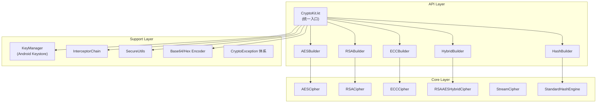
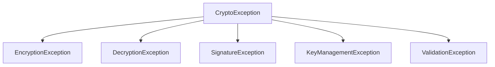

# CryptoKit 技术文档

> **版本**: 1.0.0 (CryptoKit Financial Grade)  
> **目标平台**: Android (minSdk 24, targetSdk 35)  
> **语言**: Kotlin / Java 11

---

## 一、项目概述

CryptoKit 是一个面向**金融级应用**的 Android 加密库，提供安全、易用、可扩展的加密能力。核心设计原则：

| 特性 | 描述 |
|------|------|
| **零配置使用** | 默认采用最安全配置（AES-256-GCM、RSA-2048-OAEP） |
| **金融级安全** | 敏感数据自动擦除、恒定时间比较、线程安全 |
| **完整加密能力** | 对称/非对称/混合加密、流式加密、哈希、签名 |
| **Android Keystore 集成** | 支持硬件级密钥保护 (StrongBox) |
| **可扩展架构** | 通过 AlgorithmRegistry 注册自定义算法 |

---

## 二、项目架构



### 目录结构

```
CryptoKit/src/main/java/com/example/cryptokit/
├── CryptoKit.kt                    # 统一入口对象
├── api/
│   ├── builders/                   # Builder 模式 API
│   │   ├── AESBuilder.kt          # AES 加密
│   │   ├── RSABuilder.kt          # RSA 加密/签名
│   │   ├── ECCBuilder.kt          # ECC 签名/ECDH
│   │   ├── HybridBuilder.kt       # 混合加密
│   │   ├── HashBuilder.kt         # 哈希计算
│   │   └── TripleDESBuilder.kt    # 3DES (已废弃)
│   ├── results/
│   │   ├── CipherResult.kt        # 对称加密结果
│   │   └── HybridCipherResult.kt  # 混合加密结果
│   └── extensions/                 # Kotlin 扩展
├── core/
│   ├── symmetric/                  # 对称加密实现
│   │   ├── AESCipher.kt
│   │   └── TripleDESCipher.kt
│   ├── asymmetric/                 # 非对称加密实现
│   │   ├── RSACipher.kt
│   │   └── ECCCipher.kt
│   ├── hybrid/                     # 混合加密
│   │   └── RSAAESHybridCipher.kt
│   ├── hash/                       # 哈希引擎
│   │   └── StandardHashEngine.kt
│   ├── stream/                     # 流式加密
│   │   └── StreamCipher.kt
│   ├── encoding/                   # 编码工具
│   │   ├── Base64Encoder.kt
│   │   └── HexEncoder.kt
│   └── signature/                  # 签名
│       ├── RSASignature.kt
│       └── ECDSASignature.kt
├── keymanager/                     # 密钥管理
│   ├── KeyManager.kt              # 接口
│   ├── KeyManagerImpl.kt          # 实现
│   └── KeyStoreOptions.kt         # 配置选项
├── interceptor/                    # 拦截器链
│   ├── CryptoInterceptor.kt       # 接口
│   ├── InterceptorChain.kt        # 链管理
│   ├── LoggingInterceptor.kt      # 日志拦截器
│   └── PerformanceInterceptor.kt  # 性能监控
├── exception/                      # 异常体系
│   └── CryptoException.kt
├── registry/                       # 算法注册表
│   └── AlgorithmRegistry.kt
└── util/                           # 工具类
    ├── CryptoLogger.kt            # 日志
    ├── SecureUtils.kt             # 安全工具
    ├── SecureRandomUtil.kt        # 安全随机数
    └── KeyUtils.kt                # 密钥工具
```

---

## 三、支持的加密算法

### 3.1 对称加密

| 算法 | 模式 | 密钥长度 | 推荐级别 | 说明 |
|------|------|----------|----------|------|
| **AES** | GCM | 128/192/256位 | ⭐⭐⭐ 推荐 | 默认模式，提供加密+认证 |
| AES | CBC | 128/192/256位 | ⭐⭐ | 适用于预协商密钥场景 |
| AES | CTR | 128/192/256位 | ⭐⭐ | 流密码模式 |
| 3DES | CBC | 168位 | ⚠️ 已废弃 | 仅用于兼容旧系统 |

### 3.2 非对称加密

| 算法 | 密钥长度 | 填充方案 | 说明 |
|------|----------|----------|------|
| **RSA** | 1024-4096位 | OAEP-SHA256 (默认) | 推荐 2048+ 位 |
| RSA | 1024-4096位 | OAEP-SHA1 | 兼容性选项 |
| RSA | 1024-4096位 | PKCS1 | 安全性较低 |

#### RSA 明文长度限制

| 密钥长度 | OAEP-SHA256 | PKCS1 |
|----------|-------------|-------|
| 2048位 | 190 字节 | 245 字节 |
| 4096位 | 446 字节 | 501 字节 |

### 3.3 椭圆曲线 (ECC)

| 曲线 | 别名 | 用途 |
|------|------|------|
| **P-256** | secp256r1 | ECDSA 签名 / ECDH 密钥协商 |
| P-384 | secp384r1 | 更高安全级别 |
| P-521 | secp521r1 | 最高安全级别 |

### 3.4 哈希算法

| 算法 | 摘要长度 | 推荐级别 |
|------|----------|----------|
| SHA-256 | 32 字节 | ⭐⭐⭐ 推荐 |
| SHA-384 | 48 字节 | ⭐⭐⭐ |
| SHA-512 | 64 字节 | ⭐⭐⭐ |
| SHA-1 | 20 字节 | ⚠️ 不推荐 |
| MD5 | 16 字节 | ❌ 不安全 |

---

## 四、API 详解

### 4.1 CryptoKit 入口

`CryptoKit` 是一个 Kotlin `object`（单例），提供所有加密功能的统一入口。

```kotlin
// 获取各种 Builder
CryptoKit.aes()           // AES Builder
CryptoKit.aesWithSharedKey()  // 预协商密钥 AES
CryptoKit.rsa()           // RSA Builder
CryptoKit.ecc()           // ECC Builder
CryptoKit.hybrid()        // 混合加密 Builder
CryptoKit.hash()          // 哈希 Builder

// 快捷方法
CryptoKit.encryptAES(plaintext, key, iv)   // AES 加密
CryptoKit.decryptAES(ciphertext, key, iv)  // AES 解密
CryptoKit.sha256(data)    // SHA-256 哈希
CryptoKit.sha512(data)    // SHA-512 哈希
CryptoKit.md5(data)       // MD5 哈希
CryptoKit.hmac(data, key) // HMAC 计算
CryptoKit.secureRandom(length)  // 安全随机数
CryptoKit.deriveKey(password, salt)  // PBKDF2 密钥派生

// 工具
CryptoKit.stream          // 流式加密
CryptoKit.encode          // 编码工具
CryptoKit.secure          // 安全工具
CryptoKit.keyManager      // 密钥管理
CryptoKit.registry        // 算法注册表
CryptoKit.interceptors    // 拦截器链
CryptoKit.logger          // 日志控制
```

---

### 4.2 AES 加密

#### 4.2.1 基本使用（自动密钥）

```kotlin
// 加密（自动生成密钥和 IV）
val result = CryptoKit.aes().encrypt("Hello, World!")

// 使用 use 块自动清除敏感数据
result.use { r ->
    val plaintext = CryptoKit.aes().decrypt(r)
    println(String(plaintext))
}
// 离开 use 块后，密钥和 IV 自动擦除
```

#### 4.2.2 预协商密钥场景（最常用）

```kotlin
// 客户端和服务端预先协商的密钥
val key = "0123456789abcdef0123456789abcdef".toByteArray()  // 32字节 = 256位
val iv = "0123456789abcdef".toByteArray()                   // 16字节

// 方式1：快捷方法
val ciphertext = CryptoKit.encryptAES("Hello Server", key, iv)
val plaintext = CryptoKit.decryptAES(ciphertext, key, iv)

// 方式2：字符串形式的密钥
val ciphertext = CryptoKit.encryptAES("Hello", "kk7sscksh5shwdcf", "eujvmfsvaj6tfeyr")

// 方式3：十六进制密钥
val ciphertext = CryptoKit.encryptAESHex("Hello", keyHex, ivHex)
```

#### 4.2.3 自定义配置

```kotlin
val result = CryptoKit.aes()
    .cbc()           // 使用 CBC 模式
    .keySize(192)    // 192 位密钥
    .key(myKey)      // 指定密钥
    .iv(myIv)        // 指定 IV
    .encrypt("data")
```

#### 4.2.4 GCM 模式附加认证数据 (AAD)

```kotlin
val aad = "additional authenticated data".toByteArray()
val result = CryptoKit.aes()
    .gcm()
    .aad(aad)
    .encrypt("sensitive data")
```

---

### 4.3 RSA 加密

#### 4.3.1 加密/解密

```kotlin
// 生成密钥对
val keyPair = CryptoKit.rsa().generateKeyPair()

// 加密（使用公钥）
val ciphertext = CryptoKit.rsa()
    .publicKey(keyPair.public)
    .encrypt("secret message")

// 解密（使用私钥）
val plaintext = CryptoKit.rsa()
    .privateKey(keyPair.private)
    .decryptToString(ciphertext)
```

#### 4.3.2 数字签名

```kotlin
val keyPair = CryptoKit.rsa().generateKeyPair()

// 签名
val signature = CryptoKit.rsa()
    .privateKey(keyPair.private)
    .sign("data to sign")

// 验证
val isValid = CryptoKit.rsa()
    .publicKey(keyPair.public)
    .verify("data to sign", signature)
```

---

### 4.4 ECC (椭圆曲线)

#### 4.4.1 ECDSA 签名

```kotlin
val keyPair = CryptoKit.ecc().p256().generateKeyPair()

// 签名
val signature = CryptoKit.ecc()
    .privateKey(keyPair.private)
    .sign("data")

// 验证
val isValid = CryptoKit.ecc()
    .publicKey(keyPair.public)
    .verify("data", signature)
```

#### 4.4.2 ECDH 密钥协商

```kotlin
// Alice 和 Bob 各自生成密钥对
val aliceKeyPair = CryptoKit.ecc().generateKeyPair()
val bobKeyPair = CryptoKit.ecc().generateKeyPair()

// Alice 计算共享密钥
val aliceSharedSecret = CryptoKit.ecc()
    .privateKey(aliceKeyPair.private)
    .deriveSharedSecret(bobKeyPair.public)

// Bob 计算共享密钥（结果相同）
val bobSharedSecret = CryptoKit.ecc()
    .privateKey(bobKeyPair.private)
    .deriveSharedSecret(aliceKeyPair.public)

// aliceSharedSecret == bobSharedSecret
```

---

### 4.5 混合加密

适用于加密大量数据，无 RSA 长度限制。

```kotlin
val keyPair = CryptoKit.rsa().generateKeyPair()

// 加密（使用公钥）
val result = CryptoKit.hybrid()
    .publicKey(keyPair.public)
    .aesKeySize(256)       // 可选：设置 AES 密钥大小
    .oaepSha256()          // 可选：设置 RSA 填充
    .encrypt(largeData)

// 解密（使用私钥）
val plaintext = CryptoKit.hybrid()
    .privateKey(keyPair.private)
    .decrypt(result)
```

**工作原理**:
1. 随机生成 AES 密钥
2. 使用 AES-GCM 加密数据
3. 使用 RSA 加密 AES 密钥
4. 返回加密的密钥 + 密文 + IV + 认证标签

---

### 4.6 流式加密

适用于大文件加密，避免内存溢出。

> [!WARNING]
> 流式加密**不支持 GCM 模式**，因为 GCM 需要完整数据计算认证标签。

```kotlin
val key = CryptoKit.aes().generateKey()
val iv = CryptoKit.secureRandom(16)

// 加密文件
FileInputStream("input.txt").use { input ->
    FileOutputStream("output.enc").use { output ->
        CryptoKit.stream.encrypt(input, output, key, iv, "CBC")
    }
}

// 解密文件
FileInputStream("output.enc").use { input ->
    FileOutputStream("decrypted.txt").use { output ->
        CryptoKit.stream.decrypt(input, output, key, iv, "CBC")
    }
}

// 使用流包装器
val encryptedStream = CryptoKit.stream.createEncryptOutputStream(outputStream, key, iv)
val decryptedStream = CryptoKit.stream.createDecryptInputStream(inputStream, key, iv)
```

---

### 4.7 哈希计算

```kotlin
// SHA-256（推荐）
val hash = CryptoKit.sha256("data")           // 返回 hex 字符串
val hashBytes = CryptoKit.sha256(data)        // 返回字节数组

// 使用 Builder
val hash = CryptoKit.hash("SHA-512").digestToHex("data")

// HMAC
val hmac = CryptoKit.hmac("data", key)
val hmacHex = CryptoKit.hmacToHex("data", key)

// 流式哈希（大文件）
val hash = CryptoKit.hash().digestStream(fileInputStream)

// PBKDF2 密钥派生
val salt = CryptoKit.secureRandom(16)
val derivedKey = CryptoKit.deriveKey(
    password = "myPassword",
    salt = salt,
    iterations = 100000,  // OWASP 2024 推荐最小值
    keyLength = 256
)
```

---

### 4.8 编码工具

```kotlin
// Base64
val base64 = CryptoKit.encode.toBase64(data)
val base64Url = CryptoKit.encode.toBase64Url(data)  // URL 安全
val base64NoWrap = CryptoKit.encode.toBase64NoWrap(data)  // 无换行
val decoded = CryptoKit.encode.fromBase64(base64)

// Hex
val hex = CryptoKit.encode.toHex(data)
val bytes = CryptoKit.encode.fromHex(hex)
```

---

## 五、Android Keystore 集成

### 5.1 基本使用

```kotlin
// 生成 AES 密钥（存储在 Keystore 中）
val key = CryptoKit.keyManager.generateAESKeyInKeystore("my_aes_key")

// 生成 RSA 密钥对
val keyPair = CryptoKit.keyManager.generateRSAKeyPairInKeystore("my_rsa_key")

// 生成 EC 密钥对
val ecKeyPair = CryptoKit.keyManager.generateECKeyPairInKeystore("my_ec_key")
```

### 5.2 金融级配置

```kotlin
val key = CryptoKit.keyManager.generateAESKeyInKeystore(
    alias = "payment_key",
    keySize = 256,
    options = KeyStoreOptions.financialGrade()
)
```

### 5.3 KeyStoreOptions 配置

```kotlin
data class KeyStoreOptions(
    val requireUserAuthentication: Boolean = false,  // 需要用户认证
    val authenticationValiditySeconds: Int = 30,     // 认证有效期
    val useStrongBox: Boolean = false,               // 使用 StrongBox 硬件模块
    val invalidateOnNewBiometric: Boolean = true     // 新生物识别注册时失效
)

// 预设配置
KeyStoreOptions.default()           // 默认配置
KeyStoreOptions.financialGrade()    // 金融级配置
```

### 5.4 密钥管理操作

```kotlin
// 获取密钥
val key = CryptoKit.keyManager.getKey("my_key")
val keyPair = CryptoKit.keyManager.getKeyPair("my_rsa_key")

// 检查密钥存在
val exists = CryptoKit.keyManager.containsAlias("my_key")

// 列出所有密钥
val aliases = CryptoKit.keyManager.listAliases()

// 删除密钥
CryptoKit.keyManager.deleteKey("my_key")

// 批量删除
CryptoKit.keyManager.deleteKeys(listOf("key1", "key2", "key3"))

// 检查 StrongBox 支持
val supported = CryptoKit.keyManager.isStrongBoxSupported()
```

---

## 六、安全特性

### 6.1 敏感数据自动擦除

```kotlin
// CipherResult 实现 Closeable，使用 use 块自动擦除
CryptoKit.aes().encrypt("data").use { result ->
    // 使用 result
} // 自动调用 close()，擦除密钥、IV、认证标签

// 手动擦除
CryptoKit.secure.wipe(sensitiveBytes)
CryptoKit.secure.wipe(passwordChars)

// 安全作用域
CryptoKit.secure.withSecureBytes(key) { keyBytes ->
    // 使用 keyBytes
} // 自动擦除
```

### 6.2 恒定时间比较

防止时序攻击：

```kotlin
val isEqual = CryptoKit.secure.constantTimeEquals(hash1, hash2)
```

### 6.3 安全擦除实现

```kotlin
fun wipe(data: ByteArray?) {
    if (data == null || data.isEmpty()) return
    // 第一次：随机数覆盖
    secureRandom.nextBytes(data)
    // 第二次：零覆盖
    Arrays.fill(data, 0.toByte())
}
```

---

## 七、拦截器系统

### 7.1 启用调试模式

```kotlin
// 启用日志 + 性能监控
CryptoKit.enableDebugMode()

// 仅启用日志
CryptoKit.enableLogging("MyApp")

// 仅启用性能监控
CryptoKit.enablePerformanceMonitoring(warningThresholdMs = 100)

// 禁用所有
CryptoKit.disableInterceptors()
```

### 7.2 自定义拦截器

```kotlin
class MyInterceptor : CryptoInterceptor {
    override val name: String = "MyInterceptor"
    override val priority: Int = 100  // 数字越小优先级越高
    
    override fun beforeEncrypt(data: ByteArray, algorithm: String): ByteArray {
        // 加密前处理
        return data
    }
    
    override fun afterEncrypt(data: ByteArray, algorithm: String): ByteArray {
        // 加密后处理
        return data
    }
    
    override fun beforeDecrypt(data: ByteArray, algorithm: String): ByteArray = data
    override fun afterDecrypt(data: ByteArray, algorithm: String): ByteArray = data
}

// 注册
CryptoKit.interceptors.addInterceptor(MyInterceptor())
```

---

## 八、异常体系



### 8.1 异常类型

| 异常类 | 说明 |
|--------|------|
| `CryptoException` | 基类，包含错误码 |
| `EncryptionException` | 加密失败 |
| `DecryptionException` | 解密失败 |
| `SignatureException` | 签名/验证失败 |
| `KeyManagementException` | 密钥管理失败 |
| `ValidationException` | 输入验证失败 |

### 8.2 错误码

| 类别 | 错误码范围 | 示例 |
|------|-----------|------|
| 加密相关 | 1xxx | `ENCRYPTION_FAILED(1001)`, `INVALID_KEY(1003)` |
| 签名相关 | 2xxx | `SIGNATURE_FAILED(2001)` |
| 密钥管理 | 3xxx | `KEY_NOT_FOUND(3002)` |
| 验证相关 | 4xxx | `INVALID_KEY_SIZE(4002)`, `EMPTY_INPUT(4004)` |

### 8.3 安全错误消息

```kotlin
try {
    // 加密操作
} catch (e: CryptoException) {
    // 详细错误（仅用于调试）
    Log.d("Debug", e.message)
    
    // 安全错误消息（可用于用户提示，不泄露敏感信息）
    showToast(e.getSafeMessage())
    
    // 错误码
    when (e.errorCode) {
        ErrorCode.INVALID_KEY -> handleInvalidKey()
        ErrorCode.AUTH_TAG_MISMATCH -> handleTamperedData()
        else -> handleGenericError()
    }
}
```

---

## 九、测试覆盖

项目包含完善的测试套件：

| 测试文件 | 覆盖范围 |
|----------|----------|
| `AESCipherTest.kt` | AES 各模式加解密 |
| `RSACipherTest.kt` | RSA 加解密、填充方案 |
| `HybridCipherTest.kt` | 混合加密 |
| `SignatureTest.kt` | RSA/ECDSA 签名验证 |
| `ECDHTest.kt` | ECDH 密钥协商 |
| `HashEngineTest.kt` | 哈希算法、HMAC |
| `EncodingTest.kt` | Base64/Hex 编码 |
| `SharedKeyTest.kt` | 预协商密钥场景 |
| `SecureUtilsTest.kt` | 安全工具 |
| `BoundaryConditionTest.kt` | 边界条件测试 |
| `ConcurrencyTest.kt` | 并发安全测试 |
| `PerformanceBenchmarkTest.kt` | 性能基准测试 |
| `SecurityTest.kt` | 安全性测试 |

---

## 十、最佳实践

### 10.1 安全建议

> [!IMPORTANT]
> 1. 使用 `CipherResult.use {}` 块确保敏感数据自动擦除
> 2. 生产环境使用 **AES-256-GCM**（默认配置）
> 3. RSA 密钥至少 **2048 位**
> 4. 使用 Android Keystore 存储长期密钥
> 5. 启用 **StrongBox** 硬件安全模块（如果可用）

### 10.2 预协商密钥场景

```kotlin
// ✅ 推荐：使用快捷方法
val ciphertext = CryptoKit.encryptAES("data", key, iv)

// ✅ 推荐：字符串密钥
val ciphertext = CryptoKit.encryptAES("data", "16char_key____", "16char_iv_____")

// ✅ 推荐：十六进制密钥
val ciphertext = CryptoKit.encryptAESHex("data", keyHex, ivHex)
```

### 10.3 大数据加密

```kotlin
// ❌ 不推荐：RSA 直接加密大数据（有长度限制）
CryptoKit.rsa().encrypt(largeData)  // 可能抛出异常

// ✅ 推荐：使用混合加密
CryptoKit.hybrid().publicKey(publicKey).encrypt(largeData)

// ✅ 推荐：使用流式加密
CryptoKit.stream.encrypt(inputStream, outputStream, key, iv, "CBC")
```

### 10.4 密钥派生

```kotlin
// PBKDF2 配置
val derivedKey = CryptoKit.deriveKey(
    password = password,
    salt = CryptoKit.secureRandom(16),  // 至少 16 字节
    iterations = 100000,                 // OWASP 2024 最小建议值
    keyLength = 256
)
```

---

## 十一、依赖项

```kotlin
dependencies {
    implementation(libs.androidx.core.ktx)
    implementation(libs.androidx.appcompat)
    implementation(libs.material)
    testImplementation(libs.junit)
    androidTestImplementation(libs.androidx.junit)
    androidTestImplementation(libs.androidx.espresso.core)
}
```

> **注意**: CryptoKit 仅依赖 Android 标准库和 JCE，无第三方加密库依赖。

---

## 十二、版本历史

| 版本 | 日期 | 说明 |
|------|------|------|
| 1.0.0 | 2024 | 初始发布，金融级加密套件 |

---

## 附录 A：快速参考卡片

```kotlin
// ============ AES 加密 ============
CryptoKit.encryptAES(text, key, iv)        // 加密
CryptoKit.decryptAES(cipher, key, iv)      // 解密

// ============ RSA 加密 ============
CryptoKit.rsa().publicKey(pub).encrypt(text)   // 加密
CryptoKit.rsa().privateKey(priv).decrypt(cipher) // 解密

// ============ 签名 ============
CryptoKit.rsa().privateKey(priv).sign(data)    // RSA 签名
CryptoKit.ecc().privateKey(priv).sign(data)    // ECDSA 签名

// ============ 哈希 ============
CryptoKit.sha256(data)                     // SHA-256
CryptoKit.hmac(data, key)                  // HMAC

// ============ 编码 ============
CryptoKit.encode.toBase64(bytes)           // Base64 编码
CryptoKit.encode.toHex(bytes)              // Hex 编码

// ============ 安全工具 ============
CryptoKit.secureRandom(16)                 // 安全随机数
CryptoKit.secure.wipe(data)                // 安全擦除
CryptoKit.secure.constantTimeEquals(a, b)  // 恒定时间比较

// ============ Keystore ============
CryptoKit.keyManager.generateAESKeyInKeystore("alias")
CryptoKit.keyManager.getKey("alias")
```

---

*文档生成日期: 2024-12-30*
